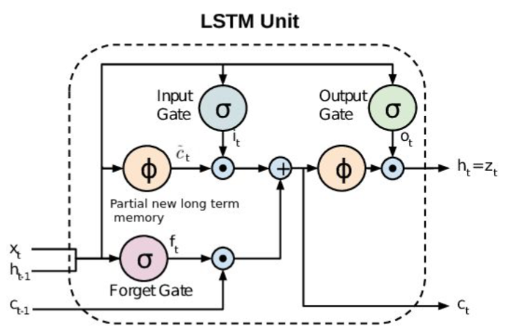
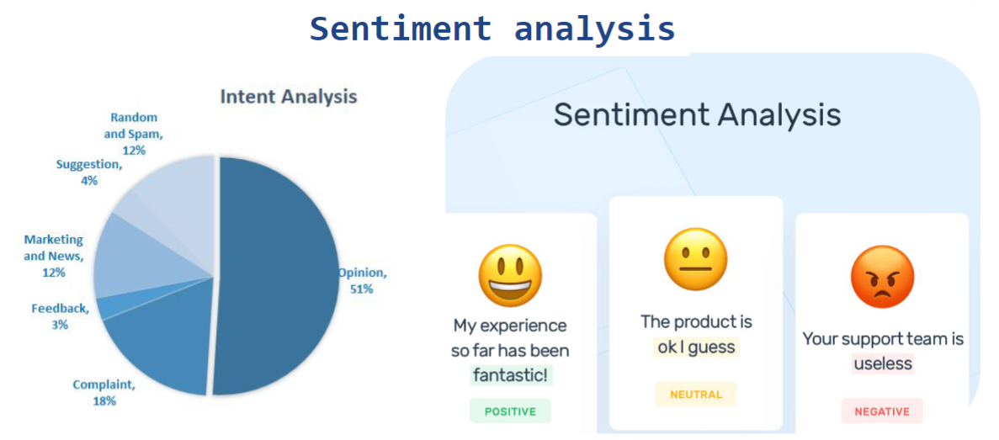

## En este repositorio se encuentran los desafíos realizados en la materia NLP de la especialización de inteligencia artificial de la FIUBA
**Autor:** Juan Ignacio Ribet

### **Desafío 1:** Vectorización

- Obtención de vocabulario del corpus
-	OneHot encoding: de una lista de textos, devolver una matriz OneHot encoding
-	Vectores de frecuencia: de una lista de textos, devolver una matriz de frecuencia
-	TF-IDF: de una lista de textos, devolver una matriz TF-IDF (Term frequency-Inverse Document Frequency)
-	Comparación de documentos ordenados por la similitud coseno

### **Desafío 2:** BOT con NLTK

BOT de obtención de información con NLTK (Natural Language Toolkit) utilizando un corpus de Wikipedia de la historia argentina.

### **Desafío 3:** Embeddings

Creación de vectores con Gensim en base al libro "Lord Of the Rings".
Análisis de términos y explicación de similitudes en el espacio de embeddings.

### **Desafío 4:** RNN: Próxima palabra

Predicción de la próxima palabra en base a las canciones de "Al Green".

### **Desafío 5:** Sentiment analysis con Embeddings y LSTM (Long short term memory)

Utilizando el dataset "clothing_ecommerce_reviews.csv" se realizó un análisis de las críticas de los compradores para determinar la evaluación de cuantas estrellas le asignaron a los productos.

*Sentiment análisis:* clasificar texto a fin de encontrar la intención o el sentimiento

  

### **Desafío 6:** Sequence to Sequence (Encoder-Decoder)

Construcción de un BOT para responder a preguntas del usuario con base en dataset de QA (ConvAI2)

***Resultado***

*Humano:* hello, how are you?

*BOT:* i m fine

*Humano:* what do you like to do

*BOT:* i like to play video games

*Humano:*  what do you do for a living

*BOT:* i m a teacher coach

*Humano:*  How old are you?

*BOT:* ask am 32 i am 32

*Humano:*  where are you from?

*BOT:* i am from russia and you

*Humano:*  I am from Argentina

*BOT:* what do you do for a living

*Humano:*  I am an engineer

*BOT:* means civil engineer

*Humano:* no, mechanical engineer

*BOT:* that sounds like a lot of fun

*Humano:*  do you like to live in russia?

*BOT:* Yes

*Humano:*  Do you read?

*BOT:* i like to read books

*Humano:*  Do you have any pet?

*BOT:* yes i have a dog
